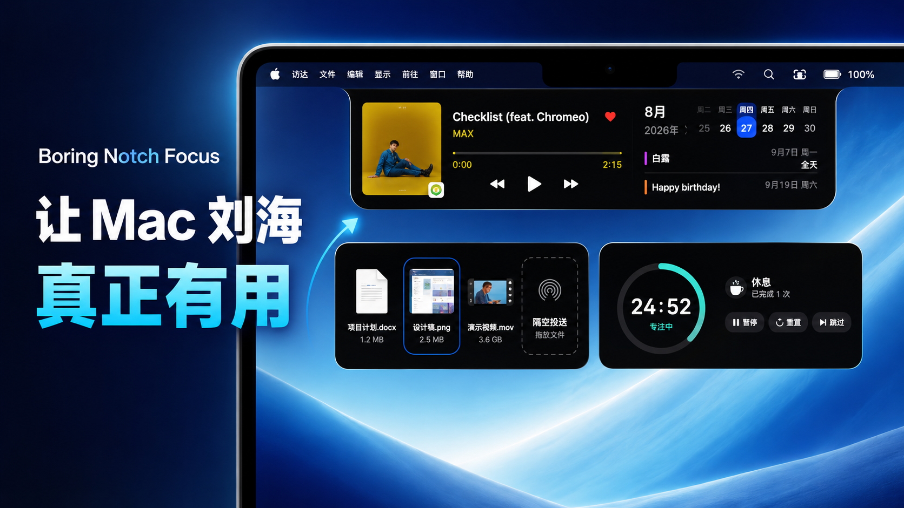
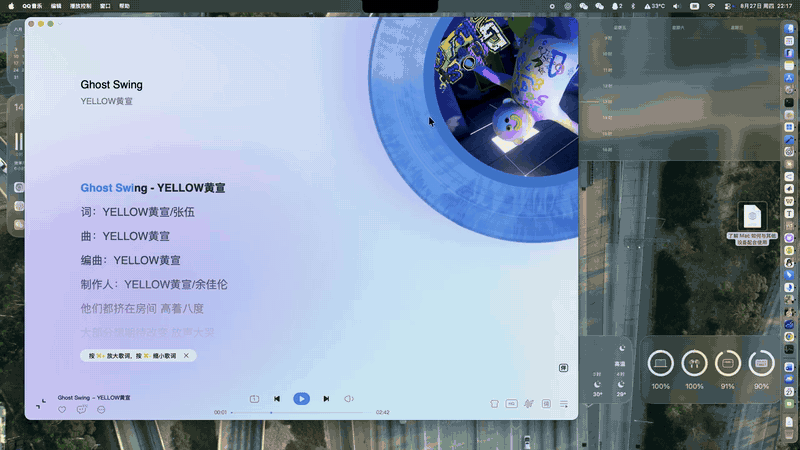
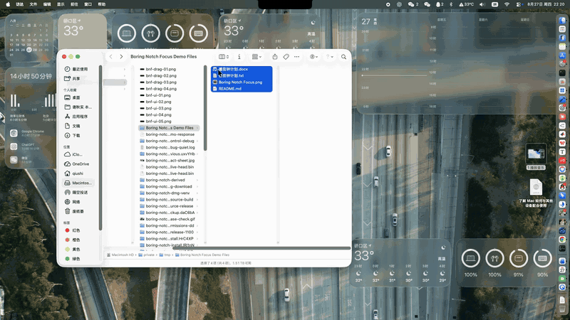
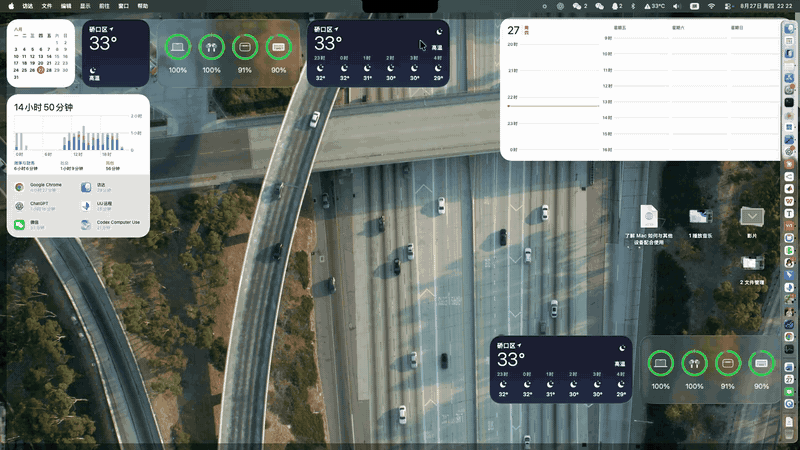

## ⬇️ Download / 下载

**[Download the latest DMG / 下载最新 DMG](https://github.com/Qiushi0919/boring-notch-focus/releases/latest/download/Boring-Notch-Focus.dmg)** · [Release notes / 版本说明](https://github.com/Qiushi0919/boring-notch-focus/releases/latest)

The installer is a GitHub Release asset, so it does not appear in the repository's source-file list. / 安装包是 GitHub Release 附件，不会出现在仓库源码文件列表中。

> [!IMPORTANT]
> **Boring Notch Focus** is a modified GPLv3 fork maintained by
> [Qiushi0919](https://github.com/Qiushi0919). It adds a focus timer and
> customized music, calendar, shelf, and Chinese-language behavior. The fork
> was first published in August 2026 and is not an official Boring Notch build.
>
> Download the current installer from
> [Boring-Notch-Focus.dmg](https://github.com/Qiushi0919/boring-notch-focus/releases/latest/download/Boring-Notch-Focus.dmg).
> After the first installation, later Focus releases are delivered by the
> app's built-in Sparkle updater.

<h1 align="center">
  <br>
  <a href="http://theboring.name"></a>
  <br>
  Boring Notch
  <br>
</h1>


<p align="center">
  <a title="Crowdin" target="_blank" href="https://crowdin.com/project/boring-notch"></a>
  
  <a href="https://discord.gg/c8JXA7qrPm">
    
  </a>
  <a href="https://www.ko-fi.com/alexander5015">
    
  </a>
</p>

<!--Welcome to **Boring.Notch**, the coolest way to make your MacBook's notch the star of the show! Forget about those boring status bars—our notch turns into a dynamic music control center, complete with a snazzy visualizer and all the music controls you need. It's like having a mini concert right at the top of your screen! -->

Say hello to **Boring Notch**, the coolest way to make your MacBook’s notch the star of the show! Say goodbye to boring status bars: with Boring Notch, your notch transforms into a dynamic music control center, complete with a vibrant visualizer and all the essential music controls you need. But that’s just the start! Boring Notch also offers calendar integration, a handy file shelf with AirDrop support, a complete MacOS HUD replacement and more!

<p align="center">
  
</p>

## Boring Notch Focus 演示 / Demo

### 音乐岛 / Music Island

<p align="center">
  
</p>

### 文件岛 / File Shelf

<p align="center">
  
</p>

### 番茄钟 / Pomodoro

<p align="center">
  
</p>

三个演示会在页面中直接播放，分别展示音乐控制、文件管理和刘海番茄钟。

These demos play directly on the page and show music controls, file management, and the notch Pomodoro timer.
---
<!--## Table of Contents
- [Installation](#installation)
- [Usage](#usage)
- [Roadmap](#-roadmap)
- [Building from Source](#building-from-source)
- [Contributing](#-contributing)
- [Join our Discord Server](#join-our-discord-server)
- [Star History](#star-history)
- [Buy us a coffee!](#buy-us-a-coffee)
- [Acknowledgments](#-acknowledgments)-->

## Installation

**System Requirements:**
- macOS **14 Sonoma** or later
- Apple Silicon or Intel Mac

---

### Option 1: Download and Install Manually

<a href="https://github.com/Qiushi0919/boring-notch-focus/releases/latest/download/Boring-Notch-Focus.dmg" target="_self"></a>

Once downloaded, open the `.dmg` and move **Boring Notch Focus** to your `/Applications` folder. The first launch starts with language selection and a reusable Permission Center.

> [!IMPORTANT]
> This build is signed for development but is not notarized with a paid Developer ID, so macOS may warn you that it cannot verify Boring Notch Focus on first launch. This is expected behavior.
>
> You'll need to bypass this before the app will open. You only need to do this once. Use one of the methods below.

---

#### Recommended: System Settings

1. Try to open the app, then dismiss the security warning.
2. Open **System Settings** > **Privacy & Security**.
3. Scroll to the security message for Boring Notch Focus and click **Open Anyway**.
4. Confirm if prompted.

---

#### Alternative: Terminal

Advanced users can remove the quarantine attribute after moving the app to Applications:

```bash
xattr -dr com.apple.quarantine "/Applications/Boring Notch Focus.app"
```

Then open the app normally.

---

### Option 2: Install via Homebrew

Homebrew currently installs the upstream official Boring Notch, not Boring Notch Focus:

```bash
brew install --cask TheBoredTeam/boring-notch/boring-notch
```

## Usage

- Launch the app, and voilà—your notch is now the coolest part of your screen.
- Hover over the notch to see it expand and reveal all its secrets.
- Use the controls to manage your music like a rockstar.
- Click the star in your menu bar to customize your notch to your heart's content.

## 📋 Roadmap
- [x] Playback live activity 🎧
- [x] Calendar integration 📆
- [x] Reminders integration ☑️
- [x] Mirror 📷
- [x] Charging indicator and current percentage 🔋
- [x] Customizable gesture control 👆🏻
- [x] Shelf functionality with AirDrop 📚
- [x] Notch sizing customization, finetuning on different display sizes 🖥️
- [x] System HUD replacements (volume, brightness, backlight) 🎚️💡⌨️
- [ ] Bluetooth Live Activity (connect/disconnect for bluetooth devices) 
- [ ] Weather integration ⛅️
- [ ] Customizable Layout options 🛠️
- [ ] Lock Screen Widgets 🔒
- [ ] Extension system 🧩
- [ ] Notifications (under consideration) 🔔
<!-- - [ ] Clipboard history manager 📌 `Extension` -->
<!-- - [ ] Download indicator of different browsers (Safari, Chromium browsers, Firefox) 🌍 `Extension`-->
<!-- - [ ] Customizable function buttons 🎛️ -->
<!-- - [ ] App switcher 🪄 -->

<!-- ## 🧩 Extensions
> [!NOTE]
> We’re hard at work on some awesome extensions! Stay tuned, and we’ll keep you updated as soon as they’re released. -->

## Building from Source

### Prerequisites

- **macOS 15.6 or later**
- **Xcode 26 or later**

### Installation

1. **Clone the Repository**:
   ```bash
   git clone https://github.com/TheBoredTeam/boring.notch.git
   cd boring.notch
   ```

2. **Open the Project in Xcode**:
   ```bash
   open boringNotch.xcodeproj
   ```

3. **Build and Run**:
    - Click the "Run" button or press `Cmd + R`. Watch the magic unfold!

## 🤝 Contributing

We’re all about good vibes and awesome contributions! Read [CONTRIBUTING.md](CONTRIBUTING.md) to learn how you can join the fun!

## Join our Discord Server

<a href="https://discord.gg/GvYcYpAKTu" target="_blank"></a>

## Star History
<!-- BROKEN: GitHub now restricts the stargazer API for privacy reasons
<a href="https://www.star-history.com/#TheBoredTeam/boring.notch&Timeline">
 <picture>
   <source media="(prefers-color-scheme: dark)" srcset="https://api.star-history.com/svg?repos=TheBoredTeam/boring.notch&type=Timeline&theme=dark" />
   <source media="(prefers-color-scheme: light)" srcset="https://api.star-history.com/svg?repos=TheBoredTeam/boring.notch&type=Timeline" />
   
 </picture>
</a>
-->
 <picture>
   <source media="(prefers-color-scheme: dark)" srcset="https://raw.githubusercontent.com/TheBoredTeam/org-star-chart-updater/main/projects/boring.notch/chart-dark.svg">
   <source media="(prefers-color-scheme: light)" srcset="https://raw.githubusercontent.com/TheBoredTeam/org-star-chart-updater/main/projects/boring.notch/chart-light.svg">
   
 </picture>

## Support us on Ko-fi!
<!-- <a href="https://www.buymeacoffee.com/jfxh67wvfxq" target="_blank"></a> -->
<a href="https://www.ko-fi.com/alexander5015" target="_blank"></a>

## 🎉 Acknowledgments

We would like to express our gratitude to the authors and maintainers of the open-source projects that made this possible. 

## Notable Projects
- **[MediaRemoteAdapter](https://github.com/ungive/mediaremote-adapter)** –  An open-source project that allowed us to use the Now Playing source in macOS 15.4+
- **[NotchDrop](https://github.com/Lakr233/NotchDrop)** – An open-source project that has been instrumental in developing the first version of the "Shelf" feature in Boring Notch.

For a full list of licenses and attributions, please see the [Third-Party Licenses](./THIRD_PARTY_LICENSES.md) file.

### Icon credits: [@maxtron95](https://github.com/maxtron95)
### Website credits: [@himanshhhhuv](https://github.com/himanshhhhuv)

- **SwiftUI**: For making us look like coding wizards.
- **You**: For being awesome and checking out **boring.notch**!

## Fork maintainer's portfolio / 此分支维护者的个人主页

[谢秋实 / Qiushi Xie · 中文主页](https://qiushi0919.cn/) · [English portfolio](https://qiushi0919.github.io/)

[个人介绍 / About Qiushi Xie](https://qiushi0919.cn/about/) · [Google Scholar](https://scholar.google.com/citations?user=TkPyZ-UAAAAJ)
